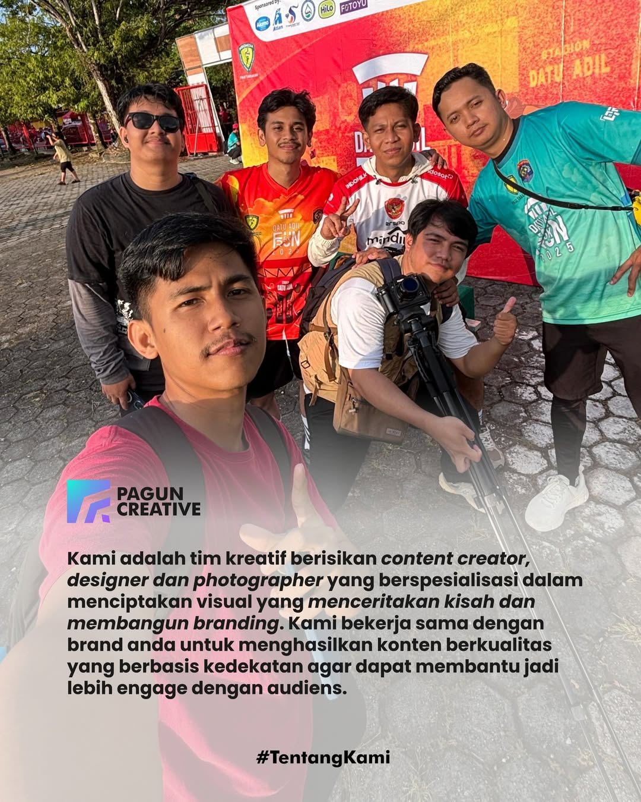

# Pagun Creative - High-End Agency Portfolio



The official digital experience for **Pagun Creative**, a full-service social media and creative agency based in Tarakan, North Kalimantan.

This project is a high-performance, immersive website built with modern web technologies, featuring "Kinetic Brutalism" aesthetics, smooth page transitions, and micro-interactions.

## 🚀 Tech Stack

-   **Framework:** [Next.js 15 (App Router)](https://nextjs.org/)
-   **Styling:** [Tailwind CSS v4](https://tailwindcss.com/)
-   **Animation:** [Framer Motion](https://www.framer.com/motion/)
-   **Smooth Scroll:** [Lenis](https://lenis.studio/)
-   **Icons:** [Lucide React](https://lucide.dev/)
-   **Language:** TypeScript

## ✨ Key Features

-   **Kinetic UI/UX:** Magnetic custom cursor, hover distortion, and fluid layout transitions.
-   **Page Transitions:** "Curtain Wipe" effect between route changes for a seamless app-like feel.
-   **Visual Storytelling:** Parallax scroll effects, infinite marquees, and text reveals.
-   **Interactive Components:** Floating Action Button (FAB) for WhatsApp and a dynamic Bento Grid for services.
-   **SEO Optimized:** Dynamic Open Graph image generation and comprehensive metadata.
-   **Performance:** Optimized images, lazy loading, and code splitting.

## 🛠️ Getting Started

First, run the development server:

```bash
npm run dev
# or
yarn dev
# or
pnpm dev
```

Open [http://localhost:3000](http://localhost:3000) with your browser to see the result.

## 📦 Deployment

This project is optimized for deployment on **Vercel**.

1.  Push this repository to GitHub.
2.  Import the project in Vercel.
3.  Vercel will automatically detect the Next.js configuration.
4.  Deploy!

## 📍 Contact

**Pagun Creative**  
Tarakan City, North Kalimantan, Indonesia  
Email: paguncreativeagency@outlook.com

---

© 2025 Pagun Creative. All rights reserved.